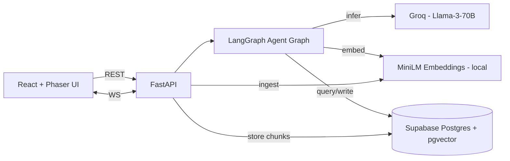
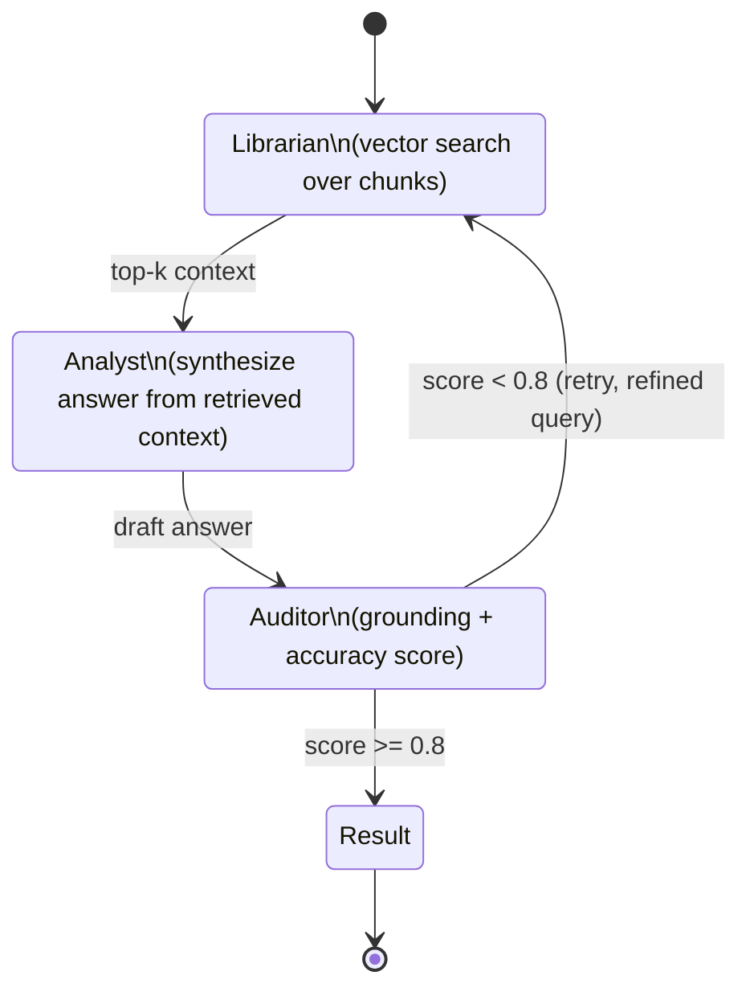

# Architecture

Cogniv-Vault is an observable agentic RAG system. A deterministic three-agent loop (Librarian → Analyst → Auditor) produces verified answers and streams its internal state to a Phaser.js client in real time.

## Components



## Agent loop

The core loop is Librarian → Analyst → Auditor, with a bounded retry when the Auditor's verification score falls below `0.8`.



### Retry rule

- Auditor emits a `score` ∈ `[0, 1]`.
- If `score >= 0.8` → answer is returned to the client.
- If `score < 0.8` → loop re-enters Librarian with a refined query derived from the Auditor's critique.
- Retries are capped (default `max_retries = 2`); on exhaustion the last draft is returned with a `low_confidence` flag.

Rationale for the 0.8 threshold is documented in [DECISIONS/0004-verification-threshold-0.8.md](DECISIONS/0004-verification-threshold-0.8.md).

## Data flow

### Ingestion (document upload)

```
Client → POST /documents (PDF)
       → FastAPI saves binary, creates `documents` row
       → pypdf extracts text
       → chunker splits into ~500-token windows (overlap 50)
       → MiniLM encodes each chunk → vector(384)
       → rows inserted into `chunks` with ivfflat-indexed embedding column
       → 202 Accepted with { document_id }
```

### Query (agent run)

```
Client → POST /query { question }
       → FastAPI enqueues a job, returns { job_id }
Client → WS /ws/query/{job_id}
       ← AGENT_START
       ← AGENT_SEARCH   { top_k_ids, scores }
       ← AGENT_SYNTHESIZE { draft }
       ← AGENT_VERIFY   { score, critique }
       ← AGENT_RETRY    { reason }     (only if score < 0.8)
       ← AGENT_RESULT   { answer, citations }
       ← AGENT_ERROR    { code, detail } (terminal on failure)
```

Full payload schemas live in [API_CONTRACTS.md](API_CONTRACTS.md).

## Observability

Every edge transition in the LangGraph graph emits a typed event through the WebSocket bridge. The Phaser scene consumes these events to animate the agents visually — the UI is a first-class observability surface, not a decorative layer.

## Deployment target (future)

- Frontend: Vercel (static + edge)
- Backend: Render (Docker)
- DB: Supabase (managed Postgres + pgvector)

Deployment details are deferred to Phase 6.
